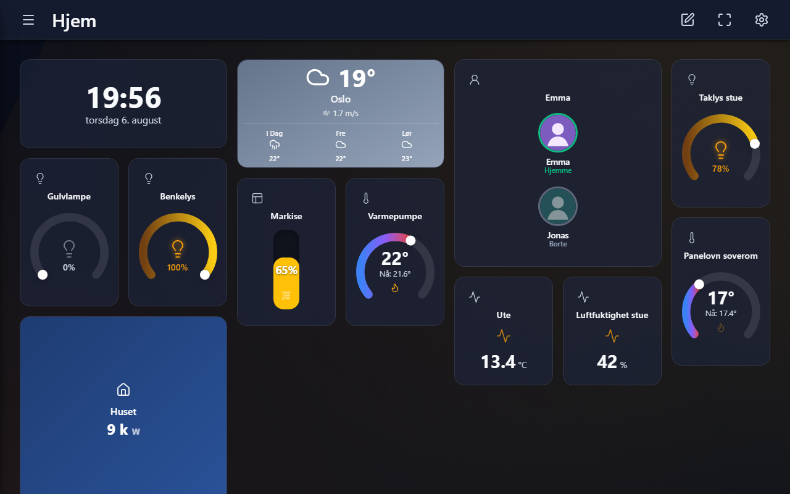
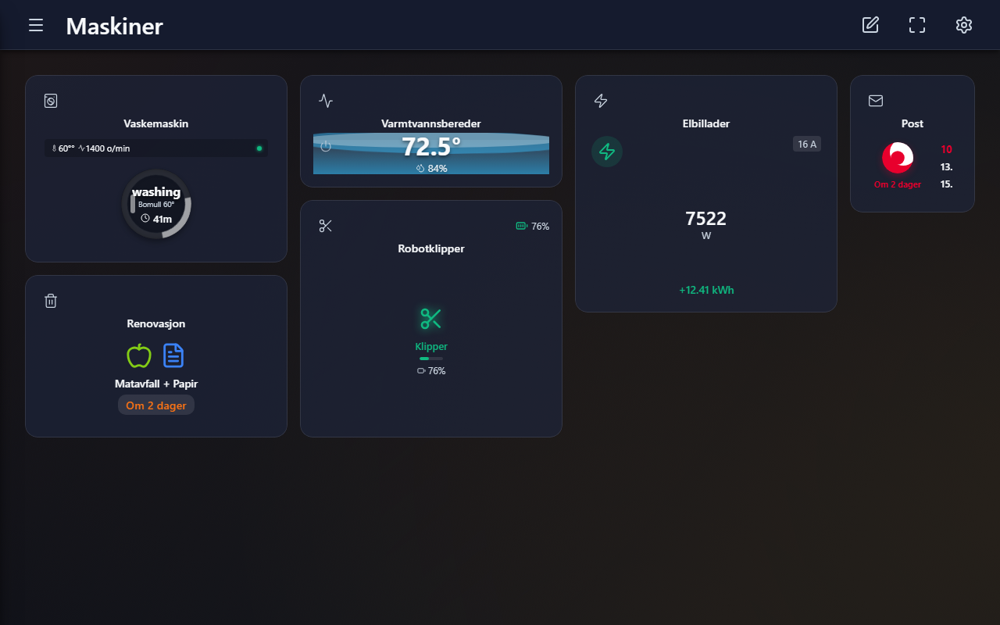
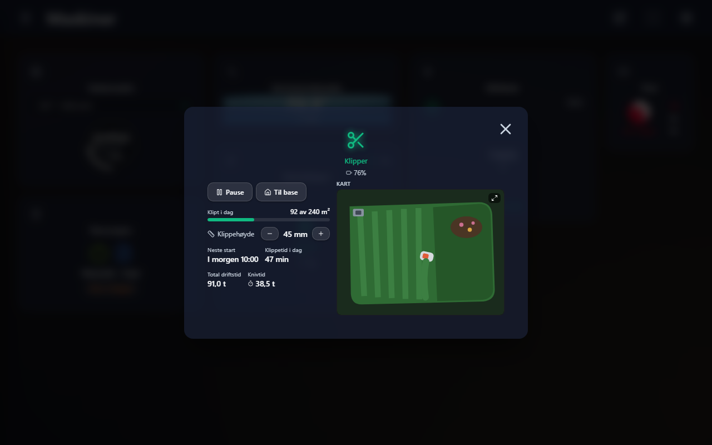

# Homeydash

> **▶ [Prøv live-demoen](https://torbmelb88.github.io/homeydash/)** — kjører i demo-modus mot et simulert smarthjem med «live» data (vaskemaskinen vasker, elbilen lader, robotklipperen klipper). Ingenting du gjør lagres.

Et smarthus-dashboard for veggmonterte nettbrett, bygget med React og Vite. Kobler til **Home Assistant** (WebSocket) eller **Homey** og viser hjemmet som interaktive fliser: lys, termostater, sensorer — men også langt rikere fliser som vaskemaskin med programstatus, varmtvannsbereder, elbillader med ladestyring, robotklipper med sanntidskart, renovasjonskalender og postlevering.



## Funksjoner

- **Flisbasert dashboard** — legg til, flytt og endre størrelse på fliser i et rutenett, organisert i sider. Redigeres direkte i appen, ingen konfigurasjonsfiler.
- **30+ flistyper**, blant annet:
  - **Vaskemaskin** — program, fase, gjenstående tid og «tomt for vaskemiddel»-varsler; global «maskinen er ferdig»-popup med slumring, uansett hvilken side som vises
  - **Oppvaskmaskin/tørketrommel på smartplugg** — tilstandsmaskin som utleder Av/Standby/Kjører/Ferdig fra effektkurven, med hysterese og rekonstruksjon fra historikk etter omstart
  - **Elbillader** — lademodus, effekt, øktenergi, kostnad og ladestyring via strømgrense (0–25 A)
  - **Robotklipper** — status, batteri, fremdrift («klipt 92 av 240 m²»), klippehøyde og «nær live» kart
  - **Varmtvannsbereder** — temperatur, fyllingsgrad, lagret energi og elementstatus
  - **Renovasjon og post** — neste hentedag per fraksjon og når posten kommer
  - **Hierarki-widget** — navigerbar trestruktur for f.eks. strømforbruk per etasje/rom/apparat
  - Vær, klokke, grafer (HA-historikk), tilstedeværelse, markiser, vifter, medieavspillere m.m.
- **Sanntid** — alle fliser oppdateres live via Home Assistants WebSocket-API.
- **Composite-enheter** — HA-entiteter grupperes automatisk per fysisk enhet (device registry), slik at en Zaptec-lader med 20 entiteter blir én rik flis.
- **Profiler** — flere dashbordoppsett (stue-nettbrett, kjøkkenpanel, mobil) synkronisert via Firestore, med localStorage som fallback/cache.
- **Kiosk-tilpasset** — bygget for Fully Kiosk Browser: skjermsparer-håndtering, popup-vekking og cache-strategi for umiddelbare deploys.

| Maskiner-siden | Utvidet robotklipper |
| --- | --- |
|  |  |

Koden inneholder også hel-sider som ikke er med i demoen: energiside, musikkside (Music Assistant), mediebibliotek (Sonarr/Radarr), familiekalender, kodepanel og intercom med toveis lyd (HA intercom_native).

## Teknologi

- **React 19** + **Vite 7** — JSX, hooks og Context API, ingen TypeScript
- **Home Assistant WebSocket/REST API** med egen mapper som oversetter HA-entiteter til Homey-lignende enheter (`src/services/hub-mapper.jsx`)
- **Firebase Cloud Firestore** (valgfritt) for synkronisering av oppsett mellom enheter
- **dnd-kit** for dra-og-slipp, **Recharts** for grafer, **Lucide** for ikoner

## Prøv demoen — uten oppsett

```bash
git clone https://github.com/torbmelb88/homeydash.git
cd homeydash
npm install
npm run dev
```

Åpne <http://localhost:5173/?demo=1>.

Demo-modusen fungerer ved at et syntetisk «hjem» defineres som ekte Home Assistant-entiteter ([src/services/demo-data.js](src/services/demo-data.js)) og kjøres gjennom nøyaktig samme mapping-pipeline som en ekte HA-tilkobling. API-laget patches med en simulator ([src/services/demo-mode.js](src/services/demo-mode.js)) som spiller av live-oppdateringer: vaskemaskinen går gjennom et helt program, berederen sykler elementene, og alt du trykker på (lys, temperatur, ladestrøm, klipperkontroller) svarer som ekte enheter. Avslutt med `?demo=0`.

## Kjøre mot ditt eget smarthjem

1. `cp .env.example .env` — Firebase-verdiene er valgfrie; uten dem lagres alt i localStorage.
2. `npm run dev`, åpne appen og velg **Innstillinger → Tilkobling**:
   - **Home Assistant**: URL (f.eks. `http://192.168.1.x:8123`) + [langtidstoken](https://developers.home-assistant.io/docs/auth_api/#long-lived-access-token)
   - **Homey**: IP + API-token
3. For synkronisering mellom enheter: opprett et Firebase-prosjekt med Firestore, fyll inn `.env`, og se `firestore.rules.example`.

For produksjon bygges appen med `npm run build` og serveres som statiske filer — `config/nginx/dashboard.conf.example` viser et komplett oppsett med samme-opprinnelse-proxyer for HA (wss uten mixed content) og cache-strategi for kiosk-nettbrett.

## Lisens

[MIT](LICENSE)
